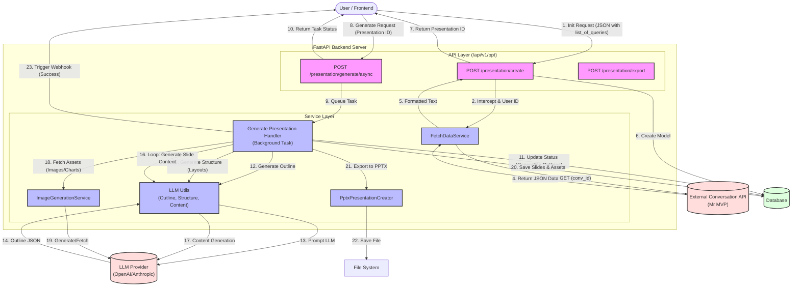

```mermaid
graph TD
    %% Actors and External Systems
    User([User / Frontend])
    ExtAPI[("External Conversation API\n(Mr MVP)")]
    LLM[("LLM Provider\n(OpenAI/Anthropic)")]
    DB[(Database)]

    %% API Endpoints
    subgraph FastAPI_Backend ["FastAPI Backend Server"]
        
        %% Component: Presentation Router
        subgraph API_Layer ["API Layer (/api/v1/ppt)"]
            CreateEP["POST /presentation/create"]
            GenerateEP["POST /presentation/generate/async"]
            ExportEP["POST /presentation/export"]
        end

        %% Component: Services
        subgraph Services ["Service Layer"]
            FetchSvc["FetchDataService"]
            GenHandler["Generate Presentation Handler\n(Background Task)"]
            LLMCalls["LLM Utils\n(Outline, Structure, Content)"]
            ImgGenSvc["ImageGenerationService"]
            PPTXCreator["PptxPresentationCreator"]
        end

    end

    %% Flow: Create Presentation (Phase 1)
    User -- "1. Init Request (JSON with list_of_queries)" --> CreateEP
    CreateEP -- "2. Intercept & User ID" --> FetchSvc
    FetchSvc -- "3. HTTP GET (conv_id)" --> ExtAPI
    ExtAPI -- "4. Return JSON Data" --> FetchSvc
    FetchSvc -- "5. Formatted Text" --> CreateEP
    CreateEP -- "6. Create Model" --> DB
    CreateEP -- "7. Return Presentation ID" --> User

    %% Flow: Generate Presentation (Phase 2)
    User -- "8. Generate Request (Presentation ID)" --> GenerateEP
    GenerateEP -- "9. Queue Task" --> GenHandler
    GenerateEP -- "10. Return Task Status" --> User

    %% Flow: Async Generation Logic
    GenHandler -- "11. Update Status (Generating Outlines)" --> DB
    GenHandler -- "12. Generate Outline" --> LLMCalls
    LLMCalls -- "13. Prompt LLM" --> LLM
    LLM -- "14. Outline JSON" --> LLMCalls
    
    GenHandler -- "15. Generate Structure (Layouts)" --> LLMCalls
    GenHandler -- "16. Loop: Generate Slide Content" --> LLMCalls
    LLMCalls -- "17. Content Generation" --> LLM
    
    GenHandler -- "18. Fetch Assets (Images/Charts)" --> ImgGenSvc
    ImgGenSvc -- "19. Generate/Fetch" --> LLM
    
    GenHandler -- "20. Save Slides & Assets" --> DB
    
    %% Flow: Export
    GenHandler -- "21. Export to PPTX" --> PPTXCreator
    PPTXCreator -- "22. Save File" --> BackendFS["File System"]
    
    GenHandler -- "23. Trigger Webhook (Success)" --> User

    %% Styling
    classDef endpoint fill:#f9f,stroke:#333,stroke-width:2px;
    classDef service fill:#bbf,stroke:#333,stroke-width:2px;
    classDef database fill:#dfd,stroke:#333,stroke-width:2px;
    classDef external fill:#fdd,stroke:#333,stroke-width:2px;

    class CreateEP,GenerateEP,ExportEP endpoint;
    class FetchSvc,GenHandler,LLMCalls,ImgGenSvc,PPTXCreator service;
    class DB database;
    class ExtAPI,LLM external;

```
